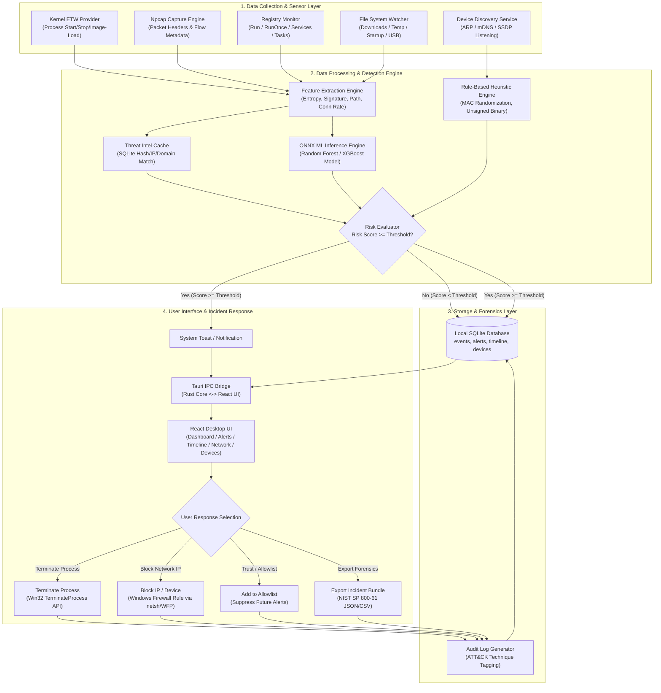
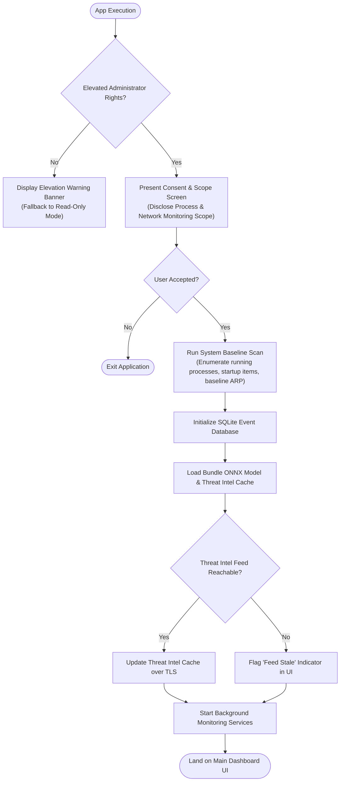
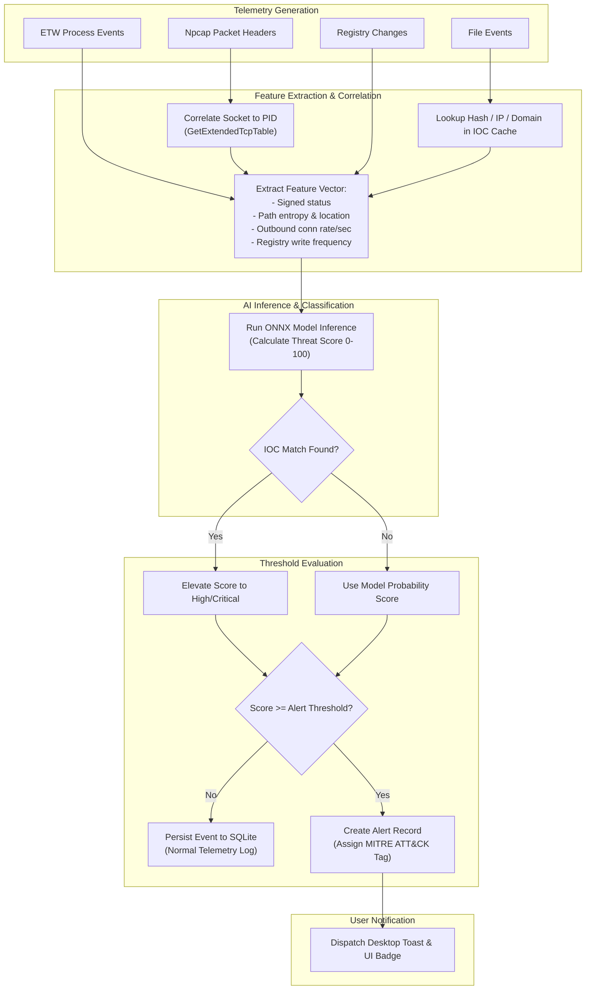
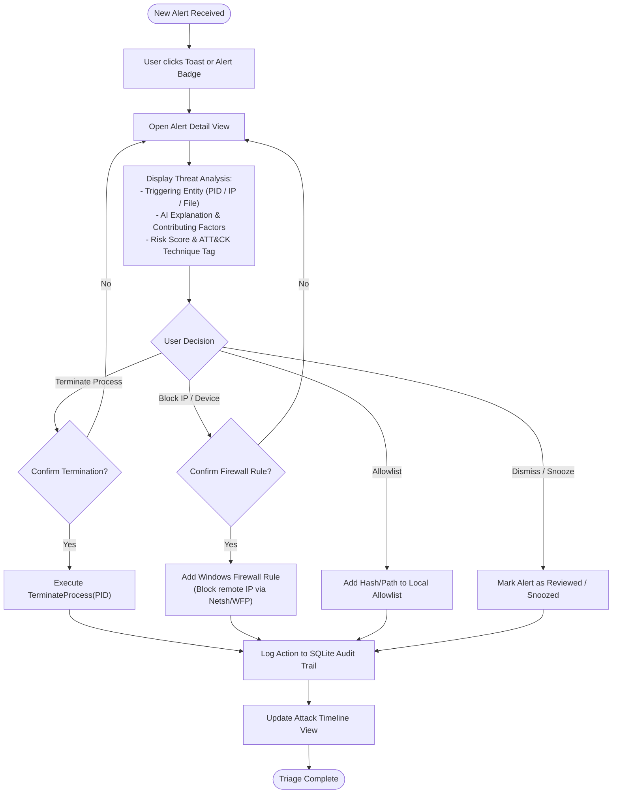
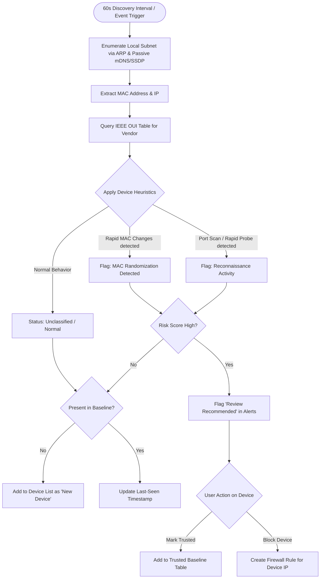
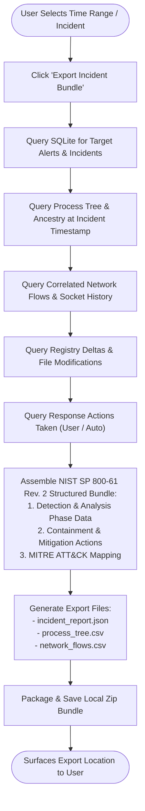

# Application Flow Diagrams — Sentinel AI

**Document Version:** 1.0  
**Project:** Sentinel AI (Desktop Security & Threat Detection Platform)  
**Target Architecture:** Tauri (Rust Core) + React + ONNX Runtime + ETW + Npcap  

---

## 1. Master System End-to-End Flow Diagram

The diagram below provides a holistic view of **Sentinel AI**, illustrating how hardware sensors, kernel tracing, passive capture, AI engine, database, and user interface interact across the lifecycle.

---

## 2. Component Detailed Flow Diagrams

### Flow 1: First-Run & Onboarding Initialization Flow

This sequence models the steps executed when Sentinel AI boots up for the first time or resumes monitoring.

---

### Flow 2: Steady-State Monitoring & Threat Detection Pipeline

This sequence outlines how incoming system signals (ETW, Npcap, Registry, File System) are processed, evaluated by the AI model, and categorized into alerts or log entries.

---

### Flow 3: Alert Triage & Incident Mitigation Workflow

This sequence details how a user interacts with an alert from notification to response enforcement and audit logging.

---

### Flow 4: Connected Device Discovery & Defense Flow

This sequence models local network device scanning, ARP table monitoring, vendor identification, and heuristic risk scoring.

---

### Flow 5: Incident Forensics Export Flow (NIST SP 800-61 Alignment)

This sequence outlines the data compilation process when generating a forensic export bundle for digital forensics and incident response (DFIR).

---

## 3. Data Flow Matrix Summary

| Data Flow Phase | Source Component | Processing Engine | Target Component / Output |
| :--- | :--- | :--- | :--- |
| **Process Monitoring** | Kernel ETW Provider (`Microsoft-Windows-Kernel-Process`) | Rust ETW Consumer & Feature Extractor | SQLite `processes` / `process_events` |
| **Network Correlation** | Npcap Driver & `GetExtendedTcpTable` | Flow Aggregator & Socket-to-PID Mapper | SQLite `network_flows` & Network UI |
| **Threat Classification** | Process & Network Feature Vectors | ONNX Runtime (`Random Forest / XGBoost`) | Risk Score (0-100) & AI Threat Explanation |
| **Device Discovery** | ARP Table & Passive mDNS Listening | IEEE OUI Lookup & Behavioral Heuristics | SQLite `devices` & Devices UI |
| **Incident Response** | UI User Action / Auto-Mitigation Engine | Win32 API (`TerminateProcess`) / Windows Firewall | Operating System Enforcement & Audit Log |
| **Forensic Audit** | SQLite Event Database | NIST SP 800-61 Package Builder | JSON / CSV Forensic Zip Bundle |

---
*End of Application Flow Diagram Document.*
