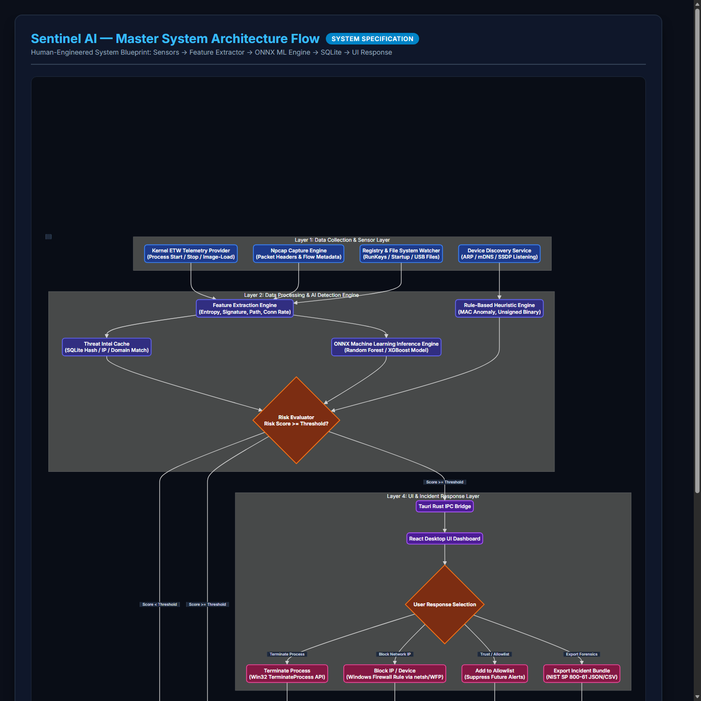

# 🛡️ Sentinel AI — Intelligent Endpoint Threat Detection and Response System

<p align="center">
  
</p>

<p align="center">
  <strong>A Next-Generation Portfolio & Enterprise-Grade Endpoint Detection and Response (EDR) Platform</strong><br>
  Powered by <code>Tauri v2</code> + <code>React 18</code> + <code>TypeScript</code> + <code>Rust</code> + <code>ONNX Runtime ML Engine</code> + <code>SQLite</code>
</p>

<p align="center">
  
  
  
  
  
  
</p>

---

## 📋 Table of Contents
- [Overview](#-overview)
- [Key Features & Capabilities](#-key-features--capabilities)
- [System Architecture & Data Pipeline](#-system-architecture--data-pipeline)
- [Visual Workflow Diagrams](#-visual-workflow-diagrams)
- [Directory Structure](#-directory-structure)
- [Prerequisites](#-prerequisites)
- [Quick Start Guide](#-quick-start-guide)
- [Machine Learning Engine](#-machine-learning-engine)
- [Database Schema](#-database-schema)
- [Documentation Reference](#-documentation-reference)
- [Security & Privacy Guarantees](#-security--privacy-guarantees)
- [Disclaimer & License](#-disclaimer--license)

---

## 📋 Overview

**Sentinel AI** is a comprehensive, production-grade Endpoint Detection and Response (EDR) and network discovery platform designed for Windows endpoint telemetry monitoring, automated AI threat evaluation, and incident response.

Combining low-overhead native system probing in **Rust**, an embedded **ONNX Machine Learning Detection Engine** (Random Forest / XGBoost), real-time process & network flow correlation, and a **glassmorphic React dashboard**, Sentinel AI provides security analysts with immediate visibility into potential threats across the host machine and local subnet.

---

## 🔥 Key Features & Capabilities

### 1. ⚡ Live Process & Behavior Monitor
- Real-time enumeration of processes using native Rust Windows system APIs.
- Tracks CPU usage, RAM utilization, process tree hierarchy, command-line parameters, binary hashes (SHA256), and digital signature status.
- Performs real-time risk scoring based on behavioral anomalies (e.g. unquoted service paths, execution from temp folders, spawned command interpreters).

### 2. 🧠 Embedded AI Threat Detection Engine
- Runs localized inference via **ONNX Runtime** without sending telemetry to external cloud servers.
- Evaluates 15+ behavioral feature vectors per process/flow (memory consumption, parent-child relationship, network outbound frequency, registry persistence indicators).
- Delivers explainable risk scores and confidence metrics per detection.

### 3. 🌐 Network Traffic & Socket Correlation
- Non-intrusive metadata flow monitoring (5-tuple: source IP/port, destination IP/port, protocol, packet counts, bytes transferred).
- Correlates socket connections directly to active local processes.
- Identifies suspicious outbound connections, DNS tunneling patterns, and known malicious IP ranges.

### 4. 🔍 Local Subnet Device Scanner
- Discovers active network devices across local subnets using ARP probing and mDNS discovery.
- Detects MAC address randomization and potential spoofing attempts.
- Maps device hostnames, vendor identifiers, and open network ports.

### 5. 🛡️ Persistence & Registry Monitor
- Scans Windows startup locations including Registry Run/RunOnce keys (`HKCU` & `HKLM`), Startup folders, and Scheduled Tasks.
- Flags suspicious, unsigned, or obfuscated persistence mechanisms commonly utilized by malware.

### 6. 🏷️ MITRE ATT&CK Alert Triage & Timeline
- Automatically tags security alerts with official **MITRE ATT&CK** technique IDs (e.g., T1059 Command and Scripting Interpreter, T1547 Boot or Logon Autostart Execution).
- Provides a unified, interactive chronological attack timeline connecting file events, process spawns, network flows, and registry edits.

### 7. 📄 NIST SP 800-61 Rev. 2 Forensic Exporter
- Export standardized incident forensic bundles adhering to **NIST SP 800-61 Rev. 2** guidelines.
- Generates JSON and Markdown audit reports containing full process telemetry, threat scores, network sockets, and mitigation recommendations for incident response teams.

---

## 🏗️ System Architecture & Data Pipeline

```
                             +-----------------------------------+
                             |     Sentinel AI Desktop Console   |
                             |   (React 18 + TypeScript + Vite)  |
                             +-----------------+-----------------+
                                               |
                                     IPC (Tauri Commands)
                                               |
  +--------------------------------------------+--------------------------------------------+
  |                                   Rust Backend Core Service                             |
  |                                                                                         |
  |  +------------------+    +-------------------+    +------------------+    +----------+  |
  |  |  Process Monitor |    |  Network Scanner  |    |  Device Scanner  |    |  Registry|  |
  |  |  (sysinfo/win32) |    |  (Socket Tracker) |    |   (ARP / mDNS)   |    |  Scanner |  |
  |  +--------+---------+    +---------+---------+    +--------+---------+    +----+-----+  |
  |           |                        |                       |                   |        |
  |           +------------------------+-----------+-----------+-------------------+        |
  |                                                |                                        |
  |                                                v                                        |
  |                               +----------------+----------------+                       |
  |                               |    ONNX ML Inference Engine     |                       |
  |                               | (Random Forest / XGBoost Model) |                       |
  |                               +----------------+----------------+                       |
  |                                                |                                        |
  |                                                v                                        |
  |                               +----------------+----------------+                       |
  |                               |    Local SQLite Data Store      |                       |
  |                               |     (14 Normalized Tables)      |                       |
  |                               +---------------------------------+                       |
  +-----------------------------------------------------------------------------------------+
```

---

## 📸 Visual Workflow Diagrams

The system includes pre-rendered, high-resolution workflow and triage diagrams located in the [`./flow_diagrams`](./flow_diagrams) directory:

- **Master System Flowchart**: [`./flow_diagrams/sentinel_ai_master_flow_diagram.png`](./flow_diagrams/sentinel_ai_master_flow_diagram.png)
- **Telemetry Detection Flow**: [`./flow_diagrams/telemetry_detection_flow.png`](./flow_diagrams/telemetry_detection_flow.png)
- **Alert Triage Workflow**: [`./flow_diagrams/alert_triage_flow.png`](./flow_diagrams/alert_triage_flow.png)

---

## 📁 Directory Structure

```
.
├── 01_Product_Requirements_Document.md    # High-level PRD & feature specifications
├── 02_Technical_Requirements_Document.md  # Technical architecture & dependency specs
├── 03_App_Flow_Document.md                # System navigation & UX flow logic
├── 04_Database_Schema_Document.md         # SQLite ERD & table definitions
├── 05_UI_UX_Design_Document.md            # Design system, color tokens & typography
├── 06_Implementation_Plan_Document.md     # Multi-phase engineering roadmap
├── 07_Security_Document.md                # Security controls & data privacy policy
├── 08_App_Flow_Diagram.md                 # System state transitions
├── flow_diagrams/                         # High-res architecture diagrams
│   ├── sentinel_ai_master_flow_diagram.png
│   ├── telemetry_detection_flow.png
│   └── alert_triage_flow.png
└── sentinel-ai/                           # Main Application Source Code
    ├── ml/                                # Python ML model training script & ONNX export
    │   ├── train_model.py
    │   └── requirements.txt
    ├── src/                               # React UI Application
    │   ├── components/                    # Reusable components (Sidebar, MitreHeatmap, etc.)
    │   ├── pages/                         # Dashboard, ProcessMonitor, Devices, Alerts, etc.
    │   ├── services/                      # Live Tauri Rust IPC bridge & telemetry feeds
    │   └── styles/                        # Glassmorphic global design system
    ├── src-tauri/                         # Rust Backend & Native Engine
    │   ├── models/                        # Embedded ONNX detection model (`detector.onnx`)
    │   ├── src/
    │   │   ├── main.rs                    # Entry point
    │   │   ├── lib.rs                     # Tauri IPC handlers & command registry
    │   │   ├── monitor.rs                 # Real-time system & process telemetry
    │   │   ├── detector.rs                # ONNX runtime inference service
    │   │   ├── network_scanner.rs         # Active network device & socket scanning
    │   │   ├── persistence_scanner.rs     # Windows Registry & startup inspector
    │   │   └── database.rs                # SQLite initialization & persistence layer
    │   ├── Cargo.toml                     # Rust dependencies
    │   └── tauri.conf.json                # Tauri v2 configuration
    ├── package.json                       # Frontend dependencies & scripts
    └── vite.config.ts                     # Vite build configuration
```

---

## ⚙️ Prerequisites

To build and run Sentinel AI locally on Windows, ensure you have the following installed:

1. **Node.js**: `v18.x` or higher (`node -v`)
2. **Rust**: `v1.70` or higher (`rustc -v`)
3. **C++ Build Tools**: Visual Studio 2022 Desktop Development with C++ (Required for Rust native compilation)
4. **Python**: `v3.9+` (Optional, only needed if retraining the ML model in `sentinel-ai/ml/`)

---

## 🚀 Quick Start Guide

### 1. Clone the Repository
```bash
git clone https://github.com/Tanmay155-glitch/Sentinal-AI.git
cd Sentinal-AI/sentinel-ai
```

### 2. Install Node Dependencies
```bash
npm install
```

### 3. Run Frontend UI (Development Mock Mode)
To view and interact with the UI components via Vite dev server:
```bash
npm run dev
```
Open your browser at `http://localhost:1420`.

### 4. Launch Full Desktop App (Tauri + Rust + Live Telemetry)
To compile the native Rust backend and run the live desktop application:
```bash
npm run tauri dev
```

### 5. Build Desktop Production Executable
```bash
npm run tauri build
```
The compiled installer (`.msi` / `.exe`) will be generated under `src-tauri/target/release/bundle/`.

---

## 🤖 Machine Learning Engine

The ML threat classification engine is located in `sentinel-ai/ml/`. It trains a **Random Forest / Gradient Boosted** classifier on process telemetry parameters and exports an optimized **ONNX** model binary into `sentinel-ai/src-tauri/models/detector.onnx`.

### Retraining the Model:
```bash
cd sentinel-ai/ml
pip install -r requirements.txt
python train_model.py
```
This updates `sentinel-ai/src-tauri/models/detector.onnx`, which is embedded directly into the Rust executable at build time.

---

## 🗄️ Database Schema

Sentinel AI uses an embedded **SQLite** database (`sentinel.db`) created automatically on first startup. The database contains 14 normalized tables:

| Table Name | Description |
|------------|-------------|
| `processes` | Historical & active process execution metadata |
| `process_events` | Process creation, termination, and privilege escalation events |
| `network_flows` | Captured socket metadata (5-tuple, bytes, packets, process ID) |
| `devices` | Discovered local network hosts, MACs, IP histories, and hostname resolved data |
| `alerts` | Threat alerts enriched with MITRE ATT&CK IDs and ONNX AI risk scores |
| `persistence_entries` | Windows Registry Run keys, Startup files, and Scheduled Tasks |
| `incidents` | Created incident investigation cases |
| `incident_exports` | Generated NIST SP 800-61 Rev.2 forensic export bundles |

---

## 📚 Documentation Reference

Detailed architectural and design specifications are included in the root folder:

- 📄 [`01_Product_Requirements_Document.md`](./01_Product_Requirements_Document.md) — Detailed product vision & operational requirements.
- 📄 [`02_Technical_Requirements_Document.md`](./02_Technical_Requirements_Document.md) — Technical specifications & technology selection rationale.
- 📄 [`03_App_Flow_Document.md`](./03_App_Flow_Document.md) — Application workflow & user journey specs.
- 📄 [`04_Database_Schema_Document.md`](./04_Database_Schema_Document.md) — Full SQLite DDL schema and entity relationships.
- 📄 [`05_UI_UX_Design_Document.md`](./05_UI_UX_Design_Document.md) — Visual design tokens, layout hierarchy, and glassmorphic UI components.
- 📄 [`06_Implementation_Plan_Document.md`](./06_Implementation_Plan_Document.md) — 8-phase implementation roadmap.
- 📄 [`07_Security_Document.md`](./07_Security_Document.md) — Security Threat Model & Privacy Controls.
- 📄 [`08_App_Flow_Diagram.md`](./08_App_Flow_Diagram.md) — State machine specifications.

---

## 🔒 Security & Privacy Guarantees

- **No Traffic Decryption**: Sentinel AI inspects only connection metadata (IP, port, packet count, protocol). It never decrypts TLS/SSL payloads.
- **Local On-Device AI**: All inference is processed locally by `ONNX Runtime` inside the Rust backend. No data or telemetry leaves your computer.
- **Zero External Server Dependency**: Sentinel AI operates fully offline without telemetry collection.

---

## ⚠️ Disclaimer

**Sentinel AI** is an advanced educational and portfolio-grade Endpoint Detection & Response platform. It is built for cybersecurity research, academic demonstration, and security monitoring. It should be used as a supplementary security analysis tool alongside standard operating system endpoint protection.

---

## 📜 License

This project is licensed under the [MIT License](LICENSE).
